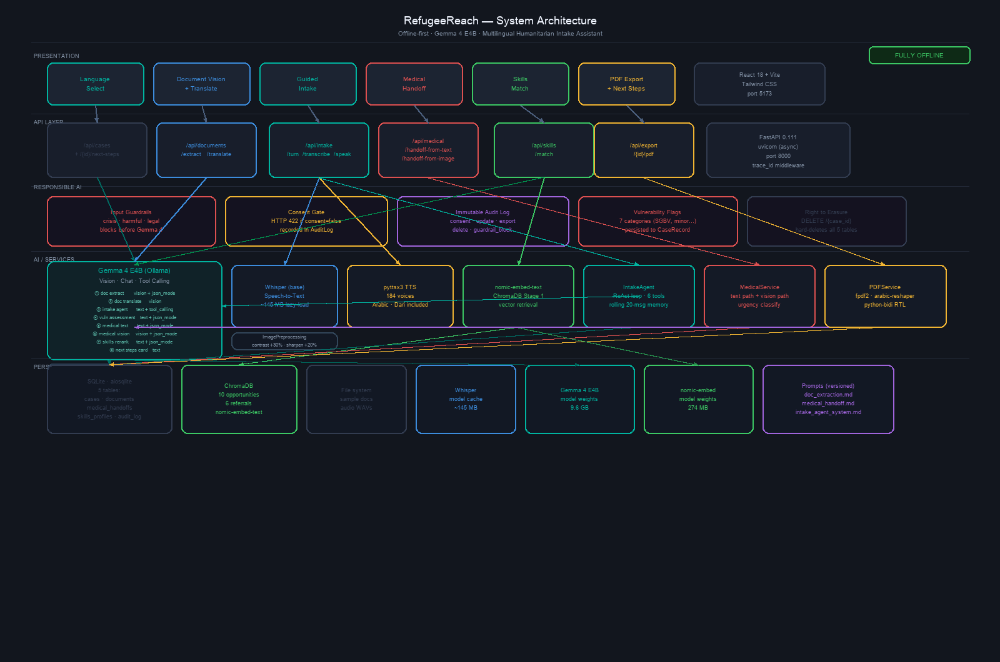

# RefugeeReach

An offline-first, multilingual, multimodal **agentic intake assistant** for displaced people — built on **Gemma 4 E4B**.

RefugeeReach is a **full-stack web application** (React 18 + FastAPI + SQLite + ChromaDB) that turns confusing documents, spoken stories, and fragmented data into actionable support: registration summaries, medical handoff notes, and skills-matched referrals — entirely on-device, no internet required.

> **Kaggle demo notebook**: for a zero-setup evaluation, a standalone Gradio notebook is available — see [Quick Evaluation (Kaggle Notebook)](#quick-evaluation-kaggle-notebook) below.

---

## Table of Contents

- [Running the App](#running-the-app)
- [Quick Evaluation (Kaggle Notebook)](#quick-evaluation-kaggle-notebook)
- [Overview](#overview)
- [Architecture](#architecture)
- [Hardware Requirements](#hardware-requirements)
- [Setup](#setup)
- [Features](#features)
- [Agentic Design](#agentic-design)
- [Responsible AI](#responsible-ai)
- [Observability](#observability)
- [Evaluation](#evaluation)
- [Project Structure](#project-structure)
- [Contributing](#contributing)
- [License](#license)

---

## Running the App

The primary project is the full-stack web application. Three setup paths:

### Option 1 — Dev Container (VS Code, one-command setup)

Requires [VS Code](https://code.visualstudio.com) and [Docker Desktop](https://www.docker.com/products/docker-desktop/).

```bash
git clone https://github.com/akkrishna311/refugeereach.git
code refugeereach          # VS Code prompts "Reopen in Container" — click it
```

The container auto-installs all Python dependencies, Node packages, ffmpeg, and Ollama. After it starts:

```bash
ollama pull gemma4:e4b        # ~10 min, one-time (9.6 GB)
ollama pull nomic-embed-text  # ~2 min (274 MB)
python scripts/seed_demo_data.py
./start.sh
```

Open **http://localhost:5173** — full app with voice input, document vision, and PDF export.

### Option 2 — Docker Compose

```bash
ollama pull gemma4:e4b
ollama pull nomic-embed-text
docker-compose up --build
docker exec refugeereach_backend python scripts/seed_demo_data.py
# UI: http://localhost:3000
```

### Option 3 — Quick start (macOS/Linux, manual)

```bash
./start.sh
```

Opens Ollama, backend, and frontend in separate Terminal windows. Checks model availability and seeds ChromaDB automatically. See [Setup](#setup) for first-time prerequisites.

---

## Quick Evaluation (Kaggle Notebook)

For evaluation without local setup, a standalone Gradio notebook is included at `notebooks/refugeereach_demo.ipynb`. It runs on Kaggle's GPU and exposes a public URL — no local install required.

[](https://www.kaggle.com/code/akkrishna311/refugeereach-demo)

1. Open the notebook and click **Run All**
2. Gemma 4 E4B loads from Kaggle's model hub — no download required
3. A public **gradio.live** URL appears in the output within ~60 seconds — no login needed to open it

> **Note**: The notebook is a self-contained evaluation path. The source of truth for architecture, agentic design, and responsible AI patterns is the full application in `app/`.

---

## Overview

Humanitarian intake centers process hundreds of displaced people per day. Staff face three compounding problems:

1. **Language barrier** — displaced people speak Arabic, Ukrainian, Dari, French, and many other languages; staff often do not.
2. **Document opacity** — passports, ID cards, and official notices are in scripts and languages staff cannot read.
3. **Fragmented handoffs** — medical notes, skills data, and registration details live in different systems or on paper.

RefugeeReach solves all three using local multimodal AI. Every interaction runs on the device — no cloud dependency, no external API, no PII transmitted externally.

---

## Architecture

### Stack

| Layer | Technology |
|-------|-----------|
| LLM | Gemma 4 E4B via Ollama (vision + chat + tool calling) |
| Embeddings | nomic-embed-text via Ollama (274 MB) |
| STT | OpenAI Whisper base (local, lazy-loaded) |
| TTS | pyttsx3 (macOS 184 voices, Arabic "Aru" included) |
| Backend | Python 3.9 + FastAPI + SQLAlchemy async + aiosqlite |
| Frontend | React 18 + Vite + Tailwind CSS |
| Vector store | ChromaDB (semantic retrieval + Gemma 4 reranking) |
| Database | SQLite (5 tables: cases, documents, medical_handoffs, skills_profiles, audit_log) |
| PDF export | fpdf2 + arabic-reshaper + python-bidi (RTL support) |

### System diagram



---

## Hardware Requirements

| Component | Minimum | Recommended |
|-----------|---------|-------------|
| RAM | 16 GB | 32 GB |
| Storage | 25 GB free | 40 GB free (Gemma 4 E4B = 9.6 GB) |
| CPU | 4 cores | Apple Silicon M-series or 8+ core x86 |
| GPU | Not required | Metal/CUDA dramatically reduces inference time |
| OS | macOS 12+, Ubuntu 20.04+, Windows 10+ | macOS 14+ (Apple Silicon) |

---

## Setup

### 1. Install Ollama

Download and install from [ollama.com](https://ollama.com).

### 2. Pull models

```bash
ollama pull gemma4:e4b        # 9.6 GB — main LLM
ollama pull nomic-embed-text  # 274 MB — embeddings
```

### 3. Clone the repo

```bash
git clone https://github.com/YOUR_USERNAME/refugeereach.git
cd refugeereach
```

### 4. Set up Python backend

Requires **Python 3.9+**.

```bash
cd app/backend
python3.9 -m venv .venv
source .venv/bin/activate      # Windows: .venv\Scripts\activate
pip install -r requirements.txt
pip install openai-whisper      # STT — downloads ~145 MB Whisper base model on first use
```

**macOS without system ffmpeg:** Whisper needs ffmpeg. Install via imageio-ffmpeg:

```bash
pip install imageio-ffmpeg
python -c "import imageio_ffmpeg, os; os.symlink(imageio_ffmpeg.get_ffmpeg_exe(), os.path.expanduser('~/.local/bin/ffmpeg'))"
export PATH="$HOME/.local/bin:$PATH"
```

### 5. Set up frontend

Requires **Node.js 18+**.

```bash
cd app/frontend
npm install
```

### 6. Seed demo data

```bash
cd ../../   # repo root
source app/backend/.venv/bin/activate
python scripts/seed_demo_data.py
```

---

## Running

After completing setup above, start the app manually if not using `./start.sh`:

```bash
# Terminal 1 — Backend
cd app/backend
source .venv/bin/activate
PATH="$HOME/.local/bin:$PATH" python -m uvicorn main:app --host 0.0.0.0 --port 8000

# Terminal 2 — Frontend
cd app/frontend
npm run dev
```

Open **http://localhost:5173** in your browser.

**API docs:** http://localhost:8000/docs

For Dev Container and Docker Compose paths, see [Running the App](#running-the-app) at the top.

---

## Features

### Language Selection
- Choose from Arabic, Ukrainian, Dari, French, or English at session start
- **Mid-session language switching** — tap the language badge in the header to switch at any point without losing case data
- Language preference persisted in localStorage and sent to all Gemma 4 calls

### Document Vision (Tab 1)
- Upload a passport, ID card, or official document image
- Gemma 4 vision extracts 7+ fields with per-field confidence scores
- **Confidence color-coding:** green (≥85% auto-accept) / amber (60–84% staff review) / red (<60% manual entry)
- **Plain-language document explanation** — translates any document into the person's language and reads it aloud via TTS
- UNHCR proGres v4 field mapping preview
- `format: json` Ollama mode ensures reliable structured output

### Guided Intake Chat (Tab 2)
- Voice or text input — agent responds in the client's language
- Whisper STT (local) → Gemma 4 multilingual agent → pyttsx3 TTS
- **ReAct agentic loop** — up to 4 inner turns: agent calls tools, observes results, then replies
- **Server-side conversation memory** — rolling 20-message window per case
- Collects required fields: name, DOB, nationality, gender, family size, location
- Progress bar with real-time field status

### Medical Handoff (Tab 3)
- Structured medical note from spoken symptoms or a photo of medical paperwork
- Gemma 4 produces urgency-classified JSON (routine / urgent / elevated)
- Safe for staff handoff — no PII sent externally

### Skills Matching (Tab 4)
- Collects prior roles, certifications, education level, spoken languages
- **Two-stage matching pipeline:**
  1. ChromaDB semantic search via nomic-embed-text (retrieves top 5 candidates)
  2. Gemma 4 reranking — selects best 3 with a `match_reason` explanation in the person's own language
- Match reasons displayed in the UI

### PDF Export (Tab 5)
- Full case summary PDF: registration data, document fields, medical note, skills profile
- Arabic reshaping + python-bidi for correct RTL rendering
- Generated locally via fpdf2 — no cloud dependency

---

## Agentic Design

RefugeeReach implements a **ReAct (Reason + Act) agent loop** with 6 tools:

| Tool | Purpose |
|------|---------|
| `extract_identity_fields` | Pull structured fields from a captured document |
| `save_case_summary` | Persist key-value fields to the SQLite case record |
| `generate_medical_handoff` | Produce a structured medical summary |
| `lookup_opportunities` | ChromaDB + Gemma 4 skills matching |
| `export_pdf` | Generate a printable case summary PDF |
| `flag_vulnerability` | Assess 7 vulnerability categories and persist flags |

The agent loop runs up to `MAX_INNER_TURNS = 4`. After each tool call, if no user-facing reply has been produced, the loop continues with a continuation signal so the agent can observe tool results before replying.

**Vulnerability categories assessed:** unaccompanied minor, pregnancy, disability, SGBV risk, urgent medical, stateless, unaccompanied elderly.

---

## Responsible AI

### Input Guardrails

Three categories checked **before any message reaches Gemma 4**:

| Trigger type | Example phrases | Response |
|---|---|---|
| `crisis_escalation` | "hurt myself", "want to die" | Directs person to staff immediately |
| `harmful_content` | "build a bomb", "make a weapon" | Safe refusal |
| `legal_disclaimer` | "guarantee my asylum" | Legal boundary disclaimer |

All guardrail blocks are logged to the `audit_log` table with trace ID.

### Consent Enforcement
- `POST /api/cases/` returns HTTP 422 if `consent_given` is not `true`
- Consent is recorded in `AuditLog` with timestamp and language

### Right to Erasure
- `DELETE /api/cases/{case_id}` hard-deletes all data across all 5 tables
- Logged to `AuditLog` before deletion

### Immutable Audit Log

Every case action is recorded in `audit_log`:

| Action | When |
|---|---|
| `consent` | Case created with consent |
| `read` | Case record accessed |
| `update` | Case fields updated |
| `export_pdf` | PDF generated |
| `delete` | Case data erased |
| `guardrail_block` | Guardrail intercepted a message |

### Vulnerability Assessment
`flag_vulnerability` tool calls Gemma 4 with `json_mode=True` to assess 7 categories and persist flags to the case record for priority routing.

### Scope statement
RefugeeReach is designed as a **front-line augmentation tool for humanitarian intake staff**. It is not a replacement for caseworkers, medical professionals, or legal advisors. Every output is explicitly framed as a support summary requiring human review and confirmation before use.

---

## Observability

### Structured JSON Logging

Every operation emits a structured JSON log line:

```json
{"event": "gemma4_call", "trace_id": "6c5b6787", "call_type": "text_with_tools",
 "latency_ms": 13986, "tool_calls": [], "eval_count": 204, "prompt_eval_count": 927}

{"event": "guardrail_triggered", "trace_id": "2c77a36f", "case_id": "...", "guardrail_type": "crisis_escalation"}

{"event": "agent_turn", "trace_id": "...", "history_depth": 4, "fields_saved": ["person_name", "nationality"]}
```

### Request Tracing
A FastAPI middleware stamps every HTTP request with a UUID `trace_id`, attaches it to `request.state`, and logs `{method, path, status, latency_ms}` on completion. The trace ID flows through to all downstream logs and audit records.

### Safe Error Handling
Exceptions return `{"error": "An internal error occurred.", "trace_id": "..."}` — no stack traces exposed to clients.

---

## Evaluation

9 evaluation suites covering correctness, safety, and multilingual accuracy:

| Suite | What it tests |
|---|---|
| 1. Health check | Backend + Ollama reachability |
| 2. Language detection | STT language accuracy across 5 languages |
| 3. Document extraction | Field extraction correctness on synthetic docs |
| 4. Medical handoff completeness | Required fields present in generated JSON |
| 5. Agent turn latency | P95 latency < 30s target |
| 6. LLM-as-judge | Gemma 4 scores its own replies: compassion / accuracy / language_match / safety (1–5) |
| 7. Multilingual accuracy | Agent replies verified to match the requested language |
| 8. Adversarial refusal | 5 harmful/crisis probes verified to trigger guardrails |
| 9. Consent enforcement | POST without consent returns HTTP 422 |

```bash
python scripts/run_evals.py
```

Results written to `models/evals/eval_results.md`.

---

## Project Structure

```
refugeereach/
├── app/
│   ├── backend/
│   │   ├── agents/          # ReAct agent loop + tool definitions
│   │   ├── db/              # SQLAlchemy models, async engine, migrations
│   │   ├── routes/          # FastAPI routers (cases, documents, intake, medical, skills, export)
│   │   ├── services/        # Business logic (LLM, STT, TTS, PDF, ChromaDB)
│   │   ├── main.py          # FastAPI app entry point + middleware
│   │   └── requirements.txt
│   └── frontend/
│       └── src/
│           ├── screens/     # Full-page views (Welcome, Document, Intake, Medical, Skills, Export)
│           └── tabs/        # Tab-level components (DocumentTab, IntakeTab, etc.)
├── data/
│   ├── opportunity_catalog/ # ChromaDB seed data — job/volunteer opportunities
│   ├── referral_catalog/    # ChromaDB seed data — service referrals
│   └── sample_documents/    # Synthetic demo documents (passports, ID cards, medical notes)
├── docs/
│   └── architecture/        # Architecture diagram
├── models/
│   ├── evals/               # Evaluation results
│   └── prompts/             # System prompts (versioned with repo)
├── notebooks/
│   └── refugeereach_demo.ipynb   # Interactive demo notebook
├── scripts/
│   ├── seed_demo_data.py    # Seed ChromaDB with opportunities and referrals
│   ├── run_evals.py         # Run all 9 evaluation suites
│   ├── generate_synthetic_docs.py  # Generate synthetic demo documents
│   └── generate_architecture_diagram.py
├── docker-compose.yml
├── start.sh                 # macOS/Linux one-command startup
└── start.ps1                # Windows PowerShell startup
```

---

## Contributing

Contributions are welcome. Please:

1. Fork the repository and create a feature branch (`git checkout -b feature/your-feature`)
2. Follow the existing code style — Python type hints, async/await throughout the backend, functional React components
3. Add or update tests in `scripts/run_evals.py` for any new model-facing functionality
4. Ensure `python scripts/run_evals.py` passes before opening a pull request
5. Open a pull request with a clear description of the change and why

**Key conventions:**
- Backend: Python 3.9 compatible — use `Optional[X]` not `X | None`
- All Gemma 4 JSON outputs must go through `_strip_fences()` to handle markdown-wrapped responses
- New agent tools must be registered in both `agents/tools.py` and the intake agent system prompt
- RTL text in PDFs must use `arabic_reshaper` + `python-bidi` before passing to fpdf2

---

## License

MIT

---

*Gemma is a trademark of Google LLC.*
